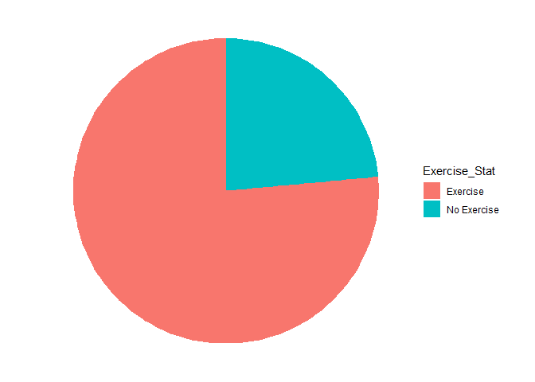
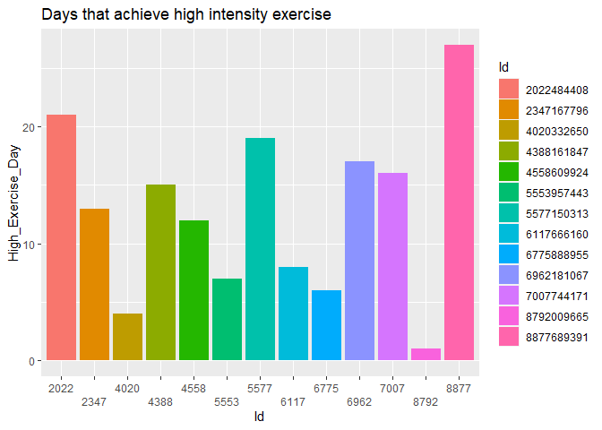
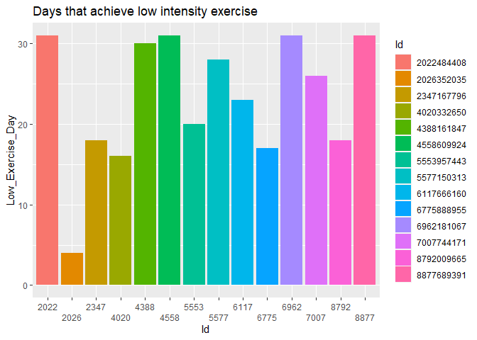
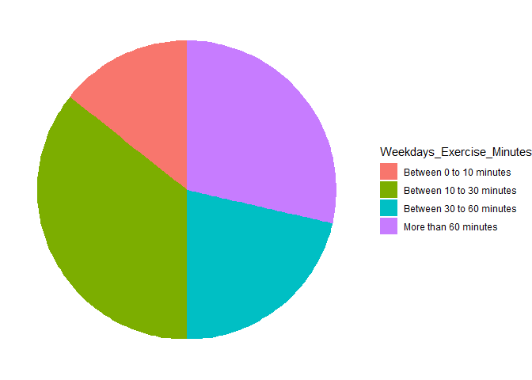
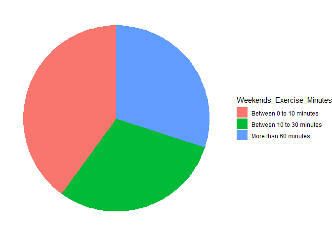
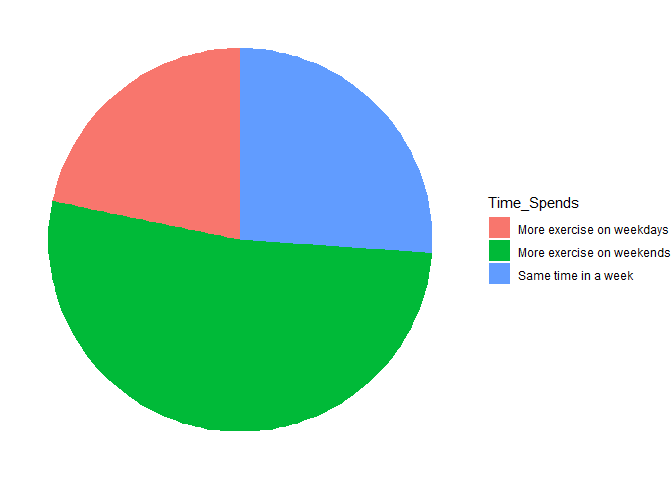
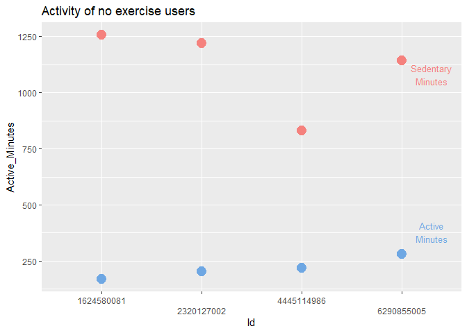
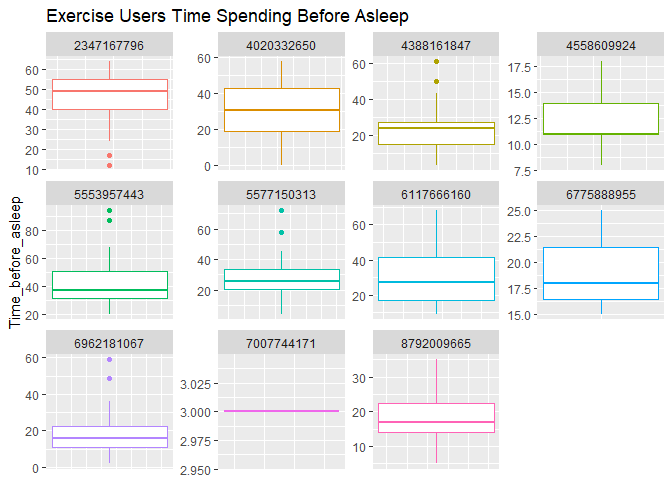
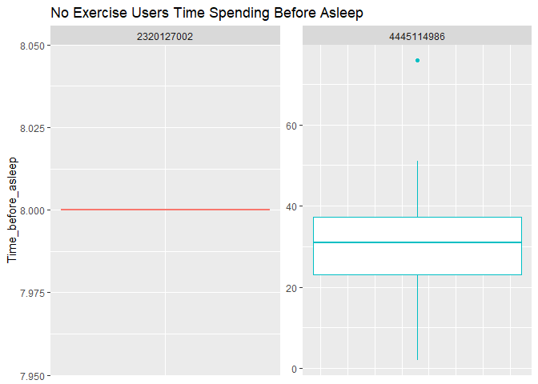
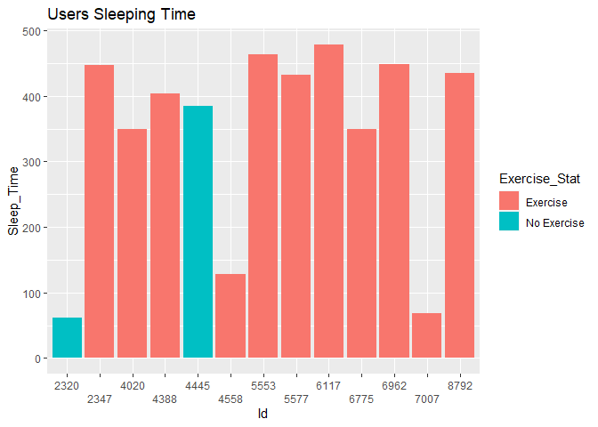

FitBit_Case_Study_1
================
Jen Yu Ou
2023-06-20

# Step 1: Set the analyze target:

    * The overall data are all gadered from the devices, so it can only represents the behaviors of the existing users.

    ### Target: Let the existing user to subscribe the membership and become more loyal to the brand.

# Step 2: Pick up the data needed

   * Data Source: https://www.kaggle.com/datasets/arashnic/fitbit 

1.  dailyActivity_merge: It merges different data and has lots of
    informaiton

2.  heartrate_seconds_merged: Heart Rate is one of the important
    information of health status, so it may also be uesful to the
    analysis. Heart reats are normally in 60 to 100 beats per minute.
    Some experts believe that an ideal resting heart rate is closer to
    50 to 70
    (<https://www.health.harvard.edu/heart-health/hows-your-heart-rate-and-why-it-matters>).
    Moreover, if people have exercise habit, their heart rate may lower
    than the people who seldom exercise, because their bodies are more
    efficient at utilizing oxygen from the blood.
    (<https://health.ucdavis.edu/sports-medicine/resources/heart-rate>)

3.  sleepDay_merged: People who engage in at least 30 minutes of
    moderate aerobic exercise may see a difference in sleep quality that
    same night
    (<https://www.hopkinsmedicine.org/health/wellness-and-prevention/exercising-for-better-sleep>).
    Therefore, it is also a good index of health.

# Step 3: Data Cleansing

1.  Add tidyverse, reader

``` r
library(readr)
library(dplyr)
```

    ## 
    ## Attaching package: 'dplyr'

    ## The following objects are masked from 'package:stats':
    ## 
    ##     filter, lag

    ## The following objects are masked from 'package:base':
    ## 
    ##     intersect, setdiff, setequal, union

``` r
library(tidyverse)
```

    ## ── Attaching core tidyverse packages ──────────────────────── tidyverse 2.0.0 ──
    ## ✔ forcats   1.0.0     ✔ stringr   1.5.0
    ## ✔ ggplot2   3.4.2     ✔ tibble    3.2.1
    ## ✔ lubridate 1.9.2     ✔ tidyr     1.3.0
    ## ✔ purrr     1.0.1

    ## ── Conflicts ────────────────────────────────────────── tidyverse_conflicts() ──
    ## ✖ dplyr::filter() masks stats::filter()
    ## ✖ dplyr::lag()    masks stats::lag()
    ## ℹ Use the conflicted package (<http://conflicted.r-lib.org/>) to force all conflicts to become errors

``` r
library(readr)
library(corrplot)
```

    ## corrplot 0.92 loaded

``` r
library(mosaic)
```

    ## Registered S3 method overwritten by 'mosaic':
    ##   method                           from   
    ##   fortify.SpatialPolygonsDataFrame ggplot2
    ## 
    ## The 'mosaic' package masks several functions from core packages in order to add 
    ## additional features.  The original behavior of these functions should not be affected by this.
    ## 
    ## Attaching package: 'mosaic'
    ## 
    ## The following object is masked from 'package:Matrix':
    ## 
    ##     mean
    ## 
    ## The following object is masked from 'package:purrr':
    ## 
    ##     cross
    ## 
    ## The following object is masked from 'package:ggplot2':
    ## 
    ##     stat
    ## 
    ## The following objects are masked from 'package:dplyr':
    ## 
    ##     count, do, tally
    ## 
    ## The following objects are masked from 'package:stats':
    ## 
    ##     binom.test, cor, cor.test, cov, fivenum, IQR, median, prop.test,
    ##     quantile, sd, t.test, var
    ## 
    ## The following objects are masked from 'package:base':
    ## 
    ##     max, mean, min, prod, range, sample, sum

``` r
library(lemon)
```

    ## 
    ## Attaching package: 'lemon'
    ## 
    ## The following object is masked from 'package:purrr':
    ## 
    ##     %||%

``` r
library(devtools)
```

    ## Loading required package: usethis

2.  Import dailyActivity_merged.csv

``` r
dailyActivity_merged <- read_csv("dailyActivity_merged.csv")
```

    ## Rows: 940 Columns: 15
    ## ── Column specification ────────────────────────────────────────────────────────
    ## Delimiter: ","
    ## chr  (1): ActivityDate
    ## dbl (14): Id, TotalSteps, TotalDistance, TrackerDistance, LoggedActivitiesDi...
    ## 
    ## ℹ Use `spec()` to retrieve the full column specification for this data.
    ## ℹ Specify the column types or set `show_col_types = FALSE` to quiet this message.

``` r
heartrate_seconds_merged <- read_csv("heartrate_seconds_merged.csv")
```

    ## Rows: 2483658 Columns: 3
    ## ── Column specification ────────────────────────────────────────────────────────
    ## Delimiter: ","
    ## chr (1): Time
    ## dbl (2): Id, Value
    ## 
    ## ℹ Use `spec()` to retrieve the full column specification for this data.
    ## ℹ Specify the column types or set `show_col_types = FALSE` to quiet this message.

``` r
sleepDay_merged <- read_csv("sleepDay_merged.csv")
```

    ## Rows: 413 Columns: 5
    ## ── Column specification ────────────────────────────────────────────────────────
    ## Delimiter: ","
    ## chr (1): SleepDay
    ## dbl (4): Id, TotalSleepRecords, TotalMinutesAsleep, TotalTimeInBed
    ## 
    ## ℹ Use `spec()` to retrieve the full column specification for this data.
    ## ℹ Specify the column types or set `show_col_types = FALSE` to quiet this message.

3.  Check_dailyActivity

- Check the unit of each column

``` r
head(dailyActivity_merged)
```

    ## # A tibble: 6 × 15
    ##           Id ActivityDate TotalSteps TotalDistance TrackerDistance
    ##        <dbl> <chr>             <dbl>         <dbl>           <dbl>
    ## 1 1503960366 4/12/2016         13162          8.5             8.5 
    ## 2 1503960366 4/13/2016         10735          6.97            6.97
    ## 3 1503960366 4/14/2016         10460          6.74            6.74
    ## 4 1503960366 4/15/2016          9762          6.28            6.28
    ## 5 1503960366 4/16/2016         12669          8.16            8.16
    ## 6 1503960366 4/17/2016          9705          6.48            6.48
    ## # ℹ 10 more variables: LoggedActivitiesDistance <dbl>,
    ## #   VeryActiveDistance <dbl>, ModeratelyActiveDistance <dbl>,
    ## #   LightActiveDistance <dbl>, SedentaryActiveDistance <dbl>,
    ## #   VeryActiveMinutes <dbl>, FairlyActiveMinutes <dbl>,
    ## #   LightlyActiveMinutes <dbl>, SedentaryMinutes <dbl>, Calories <dbl>

    + The unit of Id and ActivityDate are not suitable, so they need to be changed into character and Date

``` r
dailyActivity_merged$ActivityDate<-as.Date(dailyActivity_merged$ActivityDate, "%m/%d/%Y")
dailyActivity_merged$Id<-as.character(dailyActivity_merged$Id)
```

      * Check if there is any NA in the table

``` r
any(is.na(dailyActivity_merged))
```

    ## [1] FALSE

    + There is no NA in dailyActivity table.

- Filter out 0 in important column, such as Calories or TotalStaps

``` r
dailyActivity_merged<-filter(dailyActivity_merged, Calories != 0)
dailyActivity_merged<-filter(dailyActivity_merged, TotalSteps != 0)
```

4.  Check the heartrate data

    - Check the unit of each column

``` r
head(heartrate_seconds_merged)
```

    ## # A tibble: 6 × 3
    ##           Id Time                 Value
    ##        <dbl> <chr>                <dbl>
    ## 1 2022484408 4/12/2016 7:21:00 AM    97
    ## 2 2022484408 4/12/2016 7:21:05 AM   102
    ## 3 2022484408 4/12/2016 7:21:10 AM   105
    ## 4 2022484408 4/12/2016 7:21:20 AM   103
    ## 5 2022484408 4/12/2016 7:21:25 AM   101
    ## 6 2022484408 4/12/2016 7:22:05 AM    95

        + The unit of Id and Time needs to be adjusted

``` r
heartrate_seconds_merged$Time<-as.POSIXct(heartrate_seconds_merged$Time, format = "%m/%d/%Y %I:%M:%S %p")
heartrate_seconds_merged$Id<-as.character(heartrate_seconds_merged$Id)
```

    * Check if there is any NA in the table

``` r
any(is.na(heartrate_seconds_merged))
```

    ## [1] FALSE

        + There are NA columns in the heart rate table, so we need to remove those NA rows

``` r
heartrate_seconds_merged<-heartrate_seconds_merged %>% 
  drop_na() 
any(is.na(heartrate_seconds_merged))
```

    ## [1] FALSE

    * Filter out 0 in important column, such as heart rate

``` r
heartrate_seconds_merged<-filter(heartrate_seconds_merged, Value != 0)
```

5.  Check the Sleep data

    - Check the unit of each column

``` r
head(sleepDay_merged)
```

    ## # A tibble: 6 × 5
    ##           Id SleepDay        TotalSleepRecords TotalMinutesAsleep TotalTimeInBed
    ##        <dbl> <chr>                       <dbl>              <dbl>          <dbl>
    ## 1 1503960366 4/12/2016 12:0…                 1                327            346
    ## 2 1503960366 4/13/2016 12:0…                 2                384            407
    ## 3 1503960366 4/15/2016 12:0…                 1                412            442
    ## 4 1503960366 4/16/2016 12:0…                 2                340            367
    ## 5 1503960366 4/17/2016 12:0…                 1                700            712
    ## 6 1503960366 4/19/2016 12:0…                 1                304            320

      + The unit of Id and Time needs to be adjusted

``` r
sleepDay_merged$SleepDay<-as.Date(sleepDay_merged$SleepDay, "%m/%d/%Y")
sleepDay_merged$Id<-as.character(sleepDay_merged$Id)
```

    * Check if there is any NA in the table

``` r
any(is.na(sleepDay_merged))
```

    ## [1] FALSE

    * Filter out 0 in important column, such as Calories or TotalStaps

``` r
sleepDay_merged<-filter(sleepDay_merged, TotalSleepRecords != 0)
sleepDay_merged<-filter(sleepDay_merged, TotalMinutesAsleep != 0)
sleepDay_merged<-filter(sleepDay_merged, TotalTimeInBed != 0)
```

# Step 3: Analysis Data and Visualizaiton

    1. Daily Activities information:

        * General information:

``` r
dailyActivity_merged %>% 
  group_by(Id) %>% 
  summary()
```

    ##       Id             ActivityDate          TotalSteps    TotalDistance  
    ##  Length:863         Min.   :2016-04-12   Min.   :    4   Min.   : 0.00  
    ##  Class :character   1st Qu.:2016-04-18   1st Qu.: 4923   1st Qu.: 3.37  
    ##  Mode  :character   Median :2016-04-26   Median : 8053   Median : 5.59  
    ##                     Mean   :2016-04-26   Mean   : 8319   Mean   : 5.98  
    ##                     3rd Qu.:2016-05-03   3rd Qu.:11092   3rd Qu.: 7.90  
    ##                     Max.   :2016-05-12   Max.   :36019   Max.   :28.03  
    ##  TrackerDistance  LoggedActivitiesDistance VeryActiveDistance
    ##  Min.   : 0.000   Min.   :0.0000           Min.   : 0.000    
    ##  1st Qu.: 3.370   1st Qu.:0.0000           1st Qu.: 0.000    
    ##  Median : 5.590   Median :0.0000           Median : 0.410    
    ##  Mean   : 5.964   Mean   :0.1178           Mean   : 1.637    
    ##  3rd Qu.: 7.880   3rd Qu.:0.0000           3rd Qu.: 2.275    
    ##  Max.   :28.030   Max.   :4.9421           Max.   :21.920    
    ##  ModeratelyActiveDistance LightActiveDistance SedentaryActiveDistance
    ##  Min.   :0.0000           Min.   : 0.000      Min.   :0.00000        
    ##  1st Qu.:0.0000           1st Qu.: 2.345      1st Qu.:0.00000        
    ##  Median :0.3100           Median : 3.580      Median :0.00000        
    ##  Mean   :0.6182           Mean   : 3.639      Mean   :0.00175        
    ##  3rd Qu.:0.8650           3rd Qu.: 4.895      3rd Qu.:0.00000        
    ##  Max.   :6.4800           Max.   :10.710      Max.   :0.11000        
    ##  VeryActiveMinutes FairlyActiveMinutes LightlyActiveMinutes SedentaryMinutes
    ##  Min.   :  0.00    Min.   :  0.00      Min.   :  0.0        Min.   :   0.0  
    ##  1st Qu.:  0.00    1st Qu.:  0.00      1st Qu.:146.5        1st Qu.: 721.5  
    ##  Median :  7.00    Median :  8.00      Median :208.0        Median :1021.0  
    ##  Mean   : 23.02    Mean   : 14.78      Mean   :210.0        Mean   : 955.8  
    ##  3rd Qu.: 35.00    3rd Qu.: 21.00      3rd Qu.:272.0        3rd Qu.:1189.0  
    ##  Max.   :210.00    Max.   :143.00      Max.   :518.0        Max.   :1440.0  
    ##     Calories   
    ##  Min.   :  52  
    ##  1st Qu.:1856  
    ##  Median :2220  
    ##  Mean   :2361  
    ##  3rd Qu.:2832  
    ##  Max.   :4900

      + We can see that The average total steps are around 7500, and the total distance is about 5.3 Km, and the daily calories are around 2200KJ. The Very Active Minutes/ Distance and Fairly Active Minutes/  Distance has skewed to the left, and there are more even to the Lightly Active Minutes/ Distance. Several people who exercise more than 30 minutes, consume more than 2500 kcal a day.
      

``` r
# Find out what is the component of the users:

# There is no data related to the age, but according to some people's research, we can know the wareable devices are used more between the age 20-54.(https://journals.plos.org/digitalhealth/article?id=10.1371/journal.pdig.0000245). Therefore, we can use the above information to set the range that know the exercise situations of different users:
# Light to Medium Exercise: (220-54)*0.6 = 100 and I set about 100 heart beats per minutes for this range limit
# Medium to High (220-54)*0.8 = 132 and I set about 130 heart beats per minutes for this range limit 

## SET the Group Range
Heart_Rate_Group<-heartrate_seconds_merged %>% 
  mutate(Date = as.Date(Time), Hour = hour(Time), Minutes = minute(Time)) %>% 
  group_by(Id, Date, Hour, Minutes) %>% 
  summarize(mean_minutes_Heart_Rate = mean(Value)) %>% 
  mutate(Exercise = ifelse(
    mean_minutes_Heart_Rate >= 130, 'High', ifelse(
    mean_minutes_Heart_Rate >= 100 & mean_minutes_Heart_Rate < 130 , 'Low', 'NA')))
```

    ## `summarise()` has grouped output by 'Id', 'Date', 'Hour'. You can override
    ## using the `.groups` argument.

``` r
## Groups of the exercise users
High_Exercise<-Heart_Rate_Group %>% 
  filter(Exercise=='High') %>%
  group_by(Id, Date) %>%
  summarize(High_Ecercise_Minutes = count(Hour), High_HR = mean(mean_minutes_Heart_Rate))
```

    ## `summarise()` has grouped output by 'Id'. You can override using the `.groups`
    ## argument.
    
``` r
Low_Exercise<-Heart_Rate_Group %>% 
  filter(Exercise=='Low') %>%
  group_by(Id, Date) %>%
  summarize(Low_Ecercise_Minutes = count(Hour), Low_HR = mean(mean_minutes_Heart_Rate))
```

    ## `summarise()` has grouped output by 'Id'. You can override using the `.groups`
    ## argument.

``` r
High_Exercise_Day<-High_Exercise %>% 
  group_by(Id) %>% 
  summarize(High_Exercise_Day = count(Id)) %>% 
  arrange(desc(High_Exercise_Day))

Low_Exercise_Day<-Low_Exercise %>% 
  group_by(Id) %>% 
  summarize(Low_Exercise_Day = count(Id)) %>% 
  arrange(desc(Low_Exercise_Day))


# Filter our the user who doesn't have the record in heart rate table
HR_Id<-heartrate_seconds_merged %>% 
  subset(select=Id) %>%
  distinct(Id) %>% 
  rename(Id_HR=Id) 
HR_Id$pair<-HR_Id$Id_HR

DA_Id<-dailyActivity_merged %>% 
  subset(select=Id) %>% 
  distinct(Id)
DA_Id$pair<-DA_Id$Id

HR_DA_Both<-merge(DA_Id, HR_Id, by = 'pair', all.x= 'TRUE')

HR_DA<-HR_DA_Both%>% 
  mutate(Record = ifelse(
    is.na(Id_HR), 'No Record','Record')) %>% 
  subset(select = c(Id, Record))

New_DA<-merge(dailyActivity_merged, HR_DA, by = 'Id')
New_DA<-New_DA %>% 
  filter(Record == 'Record')

No_HR_DA<-merge(dailyActivity_merged, HR_DA, by = 'Id')
No_HR_DA<-No_HR_DA %>% 
  filter(Record == 'No Record')

## Get the users who doesn't exercise

No_Exercise_Users<-No_HR_DA %>% 
  filter(VeryActiveMinutes == 0) %>% 
  group_by(Id) %>% 
  summarize(Id=Id, No_Exercise_Day = count(Id)) %>% 
  distinct(Id, No_Exercise_Day) %>% 
  mutate(Exercise_Stat = ifelse( No_Exercise_Day >20, 'No Exercise', 'Exercise')) %>% 
  filter(Exercise_Stat == 'No Exercise') %>% 
  subset(select = c(Id, Exercise_Stat))
```

    ## Warning: Returning more (or less) than 1 row per `summarise()` group was deprecated in
    ## dplyr 1.1.0.
    ## ℹ Please use `reframe()` instead.
    ## ℹ When switching from `summarise()` to `reframe()`, remember that `reframe()`
    ##   always returns an ungrouped data frame and adjust accordingly.
    ## Call `lifecycle::last_lifecycle_warnings()` to see where this warning was
    ## generated.

    ## `summarise()` has grouped output by 'Id'. You can override using the `.groups`
    ## argument.

``` r
## Merge data
Exercise_situation<-merge(High_Exercise_Day,Low_Exercise_Day, by = 'Id', all.x=TRUE)## Exercise Day
Exercise_situation<-Exercise_situation %>% 
  mutate(Exercise_Stat = 'Exercise')

No_Exercise<-No_Exercise_Users %>% 
  mutate(High_Exercise_Day = 0, Low_Exercise_Day = 0)

Exercise_Data<- rbind(Exercise_situation, No_Exercise)
Exercise_Data_Pie<-mutate(Exercise_Data,Freq = ifelse(Exercise_Stat =='Exercise', 1, -1))

## Plot

ggplot(Exercise_Data_Pie, aes(x = "", y = Freq, fill = Exercise_Stat)) +
  geom_bar(width = 1, stat = "identity") + 
  coord_polar("y", start = 0)+
  theme_void()
```
<!-- -->

``` r
ggplot(High_Exercise_Day, aes(x = Id, y = High_Exercise_Day, fill = Id)) +
  geom_col(position = "dodge")+
  scale_x_discrete(labels = abbreviate,
                   guide = guide_axis(n.dodge =2))+
  ggtitle('Days that achieve high intensity exercise')
```

<!-- -->

``` r
ggplot(Low_Exercise_Day, aes(x = Id, y = Low_Exercise_Day, fill = Id)) +
  geom_col(position = "dodge")+
  scale_x_discrete(labels = abbreviate,
                   guide = guide_axis(n.dodge =2))+
  ggtitle('Days that achieve low intensity exercise')
```

<!-- -->

    * From the information above, the people who exercise is two times more than people who don't do exercise. The people who exercise, there are almost half of them do exercise more than or equal to 15 days in a month. There is only one user doing light exercise, others more or less do the high intensity exercise.


    * Check if there is trend in the weekdays and weekends

``` r
## Calculate weekdays and weekends
Daily_Activity_WD<-New_DA
Daily_Activity_WD$Weekdays<-wday(New_DA$ActivityDate, week_start=1)


Daily_Activity_Weekends<-filter(Daily_Activity_WD, Weekdays == 6 | Weekdays == 7)
Daily_Activity_Weekdays<-filter(Daily_Activity_WD, !Weekdays %in% c(6, 7))

## Get the activity situation in Exercise users and no exercise person
Exercise_User<-filter(Exercise_Data, Exercise_Stat == 'Exercise')
Weekdays_Exercise<-merge(Daily_Activity_Weekdays, Exercise_User, by = 'Id')
Weekends_Exercise<-merge(Daily_Activity_Weekends, Exercise_User, by = 'Id')
No_Exercise_Activity<-merge(dailyActivity_merged, No_Exercise_Users, by = 'Id')
No_Exercise_Record<-No_Exercise_Activity %>% 
  group_by(Id) %>% 
  summarize(Active_Minutes = mean(VeryActiveMinutes+FairlyActiveMinutes+LightlyActiveMinutes), SedentaryMinutes=mean(SedentaryMinutes), Calories = mean(Calories), Steps = mean(TotalSteps) )

## Time Spending in exercise

Daily_Activity_Weekends_Exercise<-subset(Daily_Activity_Weekends, select = c(Id, ActivityDate, VeryActiveMinutes))
Daily_Activity_Weekends_Exercise<-Daily_Activity_Weekends_Exercise %>% 
  group_by(Id) %>% 
  summarize(Exercise_Minutes_Median_Weekends = median(VeryActiveMinutes)) %>% 
  arrange(desc(Exercise_Minutes_Median_Weekends)) %>% 
  mutate(Weekends_Exercise_Minutes = ifelse(
    Exercise_Minutes_Median_Weekends >= 60, 'More than 60 minutes', ifelse(
      Exercise_Minutes_Median_Weekends >= 30 & Exercise_Minutes_Median_Weekends < 60, 'Between 30 to 60 minutes', ifelse(
        Exercise_Minutes_Median_Weekends >= 10 & Exercise_Minutes_Median_Weekends < 30, 'Between 10 to 30 minutes', ifelse(
          Exercise_Minutes_Median_Weekends >= 0 & Exercise_Minutes_Median_Weekends < 10,'Between 0 to 10 minutes', 'No exercise'
        )
      ))
  ) )

Daily_Activity_Weekdays_Exercise<-subset(Daily_Activity_Weekdays, select = c(Id, ActivityDate, VeryActiveMinutes))
Daily_Activity_Weekdays_Exercise<-Daily_Activity_Weekdays_Exercise %>% 
  group_by(Id) %>% 
  summarize(Exercise_Minutes_Median_Weekdays = median(VeryActiveMinutes)) %>% 
  arrange(desc(Exercise_Minutes_Median_Weekdays)) %>% 
  mutate(Weekdays_Exercise_Minutes = ifelse(
    Exercise_Minutes_Median_Weekdays >= 60, 'More than 60 minutes', ifelse(
      Exercise_Minutes_Median_Weekdays >= 30 & Exercise_Minutes_Median_Weekdays < 60, 'Between 30 to 60 minutes', ifelse(
        Exercise_Minutes_Median_Weekdays >= 10 & Exercise_Minutes_Median_Weekdays < 30, 'Between 10 to 30 minutes', ifelse(
          Exercise_Minutes_Median_Weekdays >= 0 & Exercise_Minutes_Median_Weekdays < 10,'Between 0 to 10 minutes', 'No exercise'
        )
      ))
  ) )

Exercise_Groups<-merge(Daily_Activity_Weekdays_Exercise, Daily_Activity_Weekends_Exercise, by = 'Id')
Exercise_Groups<-Exercise_Groups %>% 
  arrange(Weekdays_Exercise_Minutes,Weekends_Exercise_Minutes,desc(Exercise_Minutes_Median_Weekdays), desc(Exercise_Minutes_Median_Weekends)) %>% 
  mutate(Time_Spends = ifelse(
    Exercise_Minutes_Median_Weekdays > Exercise_Minutes_Median_Weekends, 'More exercise on weekdays', ifelse(
      Exercise_Minutes_Median_Weekdays == Exercise_Minutes_Median_Weekends, 'Same time in a week', 'More exercise on weekends')
    ))


Exercise_Timing<-merge(Exercise_Groups,High_Exercise_Day, by = 'Id')
Exercise_Timing<-Exercise_Timing%>% 
  arrange(desc(High_Exercise_Day), desc(Weekdays_Exercise_Minutes), desc(Weekends_Exercise_Minutes))

## Plot
ggplot(Exercise_Timing, aes(x='', y=Weekdays_Exercise_Minutes, fill=Weekdays_Exercise_Minutes))+
  geom_bar(stat = "identity")+
  coord_polar("y", start=0)+
  theme_void()
```

<!-- -->

``` r
ggplot(Exercise_Timing, aes(x='', y=Weekends_Exercise_Minutes, fill=Weekends_Exercise_Minutes))+
  geom_bar(stat = "identity")+
  coord_polar("y", start=0)+
  theme_void()
```

<!-- -->

``` r
ggplot(Exercise_Timing, aes(x='', y=Time_Spends, fill=Time_Spends))+
  geom_bar(stat = "identity")+
  coord_polar("y", start=0)+
  theme_void()
```

<!-- -->

``` r
ggplot(No_Exercise_Record, aes(x = Id))+
  geom_point(aes(y = Active_Minutes, size = 2), color ='#6EA7E3')+
  geom_point(aes(y = SedentaryMinutes, size = 2), color ='#F5817D')+
  scale_x_discrete(guide = guide_axis(n.dodge =2))+
  ggtitle("Activity of no exercise users")+
  theme(legend.position = 'None' )+
  annotate("text", x = 4.3 , y=380,  label = 'Active\nMinutes' , size=3.5, color = '#6EA7E3')+
  annotate("text", x = 4.3 , y=1080,  label = 'Sedentary\nMinutes' , size=3.5, color = '#F5817D')
```

<!-- -->

      * We can know from the above charts that more users spend more time exercising on weekends. Some people exercise stable every day and only a small group of people spend more time exercising on weekdays.
      
      * On weekdays exercise, there is more diverse time spent on exercising, but both on weekends and weekdays there are always about 1/3 of the users who spend more than 60 minutes in exercise. 
      
      * People who don't exercise, spend more time on sedentary activities more than 20 hours a day.
      
      

    3. Sleeping information

        * Asleep Minutes and Time in bed distribution

``` r
Sleep_group<-sleepDay_merged %>% 
  group_by(Id) %>% 
  summarize(HoursAsleep = mean(TotalMinutesAsleep)/60,HoursInBed=mean(TotalTimeInBed)/60)

sleepDay_cal<-sleepDay_merged %>% 
  mutate(Time_before_asleep = (TotalTimeInBed -TotalMinutesAsleep))
Summary_Sleep<-favstats(Time_before_asleep~Id, data = sleepDay_cal)

Time_before_asleep<-sleepDay_cal %>% 
  group_by(Id) %>% 
  summarize(TimeBeforeSleep = mean(Time_before_asleep))


Merge_Sleep<-merge(Sleep_group, Time_before_asleep, by='Id')
sleepDay_merged<-sleepDay_merged %>% 
  mutate(Time_before_asleep = TotalTimeInBed -TotalMinutesAsleep)

Exercise_Sleep<-merge(sleepDay_merged, Exercise_User, by= 'Id')
No_Exercise_Sleep<-merge(sleepDay_merged, No_Exercise_Record, by= 'Id')

Sleep_Time_EX<- Exercise_Sleep %>% 
  group_by(Id) %>% 
  summarize(Sleep_Time = mean(TotalMinutesAsleep), Exercise_Stat = 'Exercise')

Sleep_Time_No_EX<-No_Exercise_Sleep %>% 
  group_by(Id) %>% 
  summarize(Sleep_Time = mean(TotalMinutesAsleep), Exercise_Stat = 'No Exercise')

Sleep_Time<-rbind(Sleep_Time_EX, Sleep_Time_No_EX)

## Plot
ggplot(Exercise_Sleep, aes(SleepDay, Time_before_asleep, color = Id))+
  geom_boxplot()+facet_wrap(~Id, scales = 'free')+
  theme(axis.title.x=element_blank(), 
        axis.text.x=element_blank(),
        axis.ticks.x=element_blank(), 
        legend.position = 'None')+
  ggtitle('Exercise Users Time Spending Before Asleep')
```

<!-- -->

``` r
ggplot(No_Exercise_Sleep, aes(SleepDay, Time_before_asleep, color = Id))+
  geom_boxplot()+facet_wrap(~Id, scales = 'free')+
  theme(axis.title.x=element_blank(), 
        axis.text.x=element_blank(),
        axis.ticks.x=element_blank(), 
        legend.position = 'None')+
  ggtitle('No Exercise Users Time Spending Before Asleep')
```

<!-- -->

``` r
ggplot(Sleep_Time, aes(Id, Sleep_Time, fill = Exercise_Stat))+
  geom_bar(stat = 'identity')+
  scale_x_discrete(labels = abbreviate,
                   guide = guide_axis(n.dodge =2))+
  ggtitle('Users Sleeping Time')
```

<!-- -->

        * From the boxplot above, we can see that most users are asleep between 6 hrs to 8 hrs. There is no obvious difference in seeping time between the group of users who exercise and don't exercise. 

        * According to the reports that normal people fall asleep in about 10-20 minutes(https://reurl.cc/K0Aga9). However, there is also no obvious difference in time to fall asleep between the group that exercise or doesn't exercise. We can tell that only four people fall asleep in the recommended period, others may use too long time or less time to fall asleep, which is not a good phenomenon to keep good sleep habits.
        

# Marketing Recommendation:

    1. We can generally know that more users have stable habits of exercising and there are 1/3 of them spend more than an hour exercising in a day. Therefore, to those users, we can recommend they to subscribe the membership for the advanced information provided by the system. Moreover, they may also want more comprehensive data in their records, so it is also a good way to provide the bundle package if they subscribe to the membership, then they can get a huge discount to buy the water bottle which can teach the hydration levels to let their training become more effective.

    2. It seems that people have the sleeping issue nowadays, more people take more than 25 minutes to fall asleep. However, we cannot know whether it bothers the users or not. We can send the notice to the app or the devices to the users about their sleeping situation and some related knowledge. If they want to know more information or help they can subscribe for the membership.

    3. Since more people spend more time on weekends doing exercise, we can hold more exercise activities such as running competitions, free aerobic classes in specific gyms, or different health lectures. Those activities can face all users but the member is free or can have a discount. Therefore,  users who like exercise can also have a chance to contact others that have the same habits. It can let the users have more connection to the brand. 
          
    4. It is interesting that there are several people doesn't do exercise but still use the product. They spend more than 1200 minutes(20hr) sedentary. Those people may have another purpose to use the devices. Therefore, we can get more investigation about what kinds of devices they bought and what is the age of them to find out new segments of the users.


        
